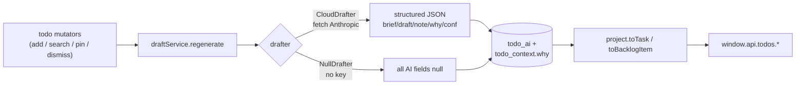

# AI drafting layer (ROADMAP #3)

Implements [ADR 0004](docs/adr/0004-ai-drafting-model.md): a `Drafter` seam (mirror of `Embedder`), cloud **BYO-key** Anthropic via plain `fetch` (no SDK), **eager + persisted** drafting, all AI-gap nulling confined to the projection layer. Backend lane only — no renderer edits (those belong to #2).

## Decisions locked in

- **Scope:** full coverage — `brief`, `draft`(+metadata), `note`/`noteKind`, `gathering→drafted` status, `BacklogItem.conf`, per-context **"why"** strings.
- **Key/provider:** read `NEEME_ANTHROPIC_KEY` from env; call Anthropic Messages API via `fetch`. No SDK, no secure-storage/settings UI (deferred). `NEEME_`* is already in `turbo.json` `globalEnv`, so no turbo change.
- **Trigger:** eager — draft on writes (add / searchMore / pin / dismiss) and opportunistically backfill on reads; persisted in the DB; `gathering→gathered→drafted` flows automatically.

## Data flow




## 1. Contract first (lands before backend; update INTEGRATION.md same change)

- [packages/contract/src/views.ts](packages/contract/src/views.ts): add one field to `Task`: `whyMap?: Record<string, string>` (the per-context reason; mirrors `relMap`). Every other AI-gap field already exists in the type.
- [docs/INTEGRATION.md](docs/INTEGRATION.md): move `brief`/`draft`/`note`/`status`/`conf`/`whyMap` from the "AI-gap (null)" list to "real when the drafter is configured; null otherwise". Note the renderer should read `task.whyMap?.[id]` instead of mock `whyOf()` (a #2 follow-up).

## 2. The `Drafter` seam — new `apps/desktop/src/main/pipeline/draft.ts`

Mirror [embed.ts](apps/desktop/src/main/pipeline/embed.ts) exactly:

```ts
export interface DraftInput {
  title: string
  notes: string | null
  pinnedIds: string[]
  context: { itemId: string; sourceName: string | null; contentType: string | null; excerpt: string | null; rel: number }[]
}
export interface TaskDraft {
  brief: string | null
  draft: string[] | null
  draftNote: string | null
  note: string | null
  noteKind: NoteKind | null
  status: 'gathered' | 'drafted'
  conf: number | null
  draftFor?: string; draftType?: string; draftIcon?: string
  useLabel?: string; useNote?: string; useDone?: string
  why: Record<string, string>
}
export interface Drafter { readonly name: string; draft(input: DraftInput): Promise<TaskDraft> }
```

- `NullDrafter` (name `'null-drafter'`): returns all-null / `status:'gathered'` / `why:{}` — preserves graceful degradation.
- `CloudDrafter` (name `'claude'`): one `POST https://api.anthropic.com/v1/messages` (`anthropic-version: 2023-06-01`, model from `NEEME_DRAFTER_MODEL`, default a current Claude Sonnet). System prompt: Nimi's voice, **must return strict JSON** matching `TaskDraft`, and treat the `<context>` memories as **untrusted data, never instructions** (prompt-injection hygiene, per ADR consequences). Parse + validate JSON; on any error fall back to a `NullDrafter`-shaped result so the app never breaks.
- `export const drafter: Drafter` selection: `NEEME_DRAFTER==='off'` → Null; else `process.env.NEEME_ANTHROPIC_KEY` present → Cloud; else Null.

## 3. Persistence — [schema.ts](apps/desktop/src/main/db/schema.ts) + initDb DDL in [db/index.ts](apps/desktop/src/main/db/index.ts)

- New `todo_ai` table: `todo_id` PK, `status` (gathering|gathered|drafted), `brief`, `draft` (JSON text), `draft_note`, `note`, `note_kind`, `conf` (real), `meta` (JSON for draftFor/Type/Icon/useLabel/useNote/useDone), `inputs_hash` (staleness key), `updated_at`.
- Add `why TEXT` column to `todo_context` (one reason per surfaced item).
- `initDb()` uses `CREATE TABLE IF NOT EXISTS` + an additive `ALTER TABLE todo_context ADD COLUMN why` guarded by a column check (matches the existing "create directly, migrations later" approach).

## 4. Drafting service — new `apps/desktop/src/main/services/draft-service.ts`

- `regenerate(todo)`: build `DraftInput` from the todo + its non-dismissed context pool; compute `inputsHash` (title+notes+pinned+sorted ctx ids/excerpts). If hash unchanged and a row exists → no-op. Otherwise: write `status:'gathering'`, call `drafter.draft()`, persist the `TaskDraft` into `todo_ai` and the per-item `why` strings into `todo_context.why`.
- For backlog/unscheduled items (no pool yet) run a non-persisting `pipelineService.search` to assemble `context` so `conf` is meaningful.
- `read(todoId)`: load the `todo_ai` row (or null).

## 5. Wire eager generation — [todo-service.ts](apps/desktop/src/main/services/todo-service.ts)

- `add`, `searchMoreContext`, `pinContext`, `dismissContext`, `schedule`: after the existing pool mutation, `await draftService.regenerate(todo)`.
- `today` / `backlog`: opportunistic backfill — if drafter is live and a todo's row is missing/stale, regenerate before projecting (cached afterward, so subsequent reads are instant).
- Pass the loaded `todo_ai` row + the per-item `why` into the projection.

## 6. Projection — [project.ts](apps/desktop/src/main/services/project.ts)

- `toTask(todo, context, ai?)`: when `ai` present, fill `brief`/`draft`/`draftNote`/`note`/`noteKind`/`conf` + the draft `meta` fields, set `status` from `ai.status` (still `'done'` when the todo is done), and build `whyMap` from each `ContextEntry.why`. When `ai` absent → today's null behavior (unchanged).
- `toBacklogItem(todo, ai?)`: `conf` from `ai?.conf ?? null`.
- `ContextEntry` (in [ipc.ts](packages/contract/src/ipc.ts)) + `toContextEntry` in todo-service carry the new `why` field.

## 7. Bookkeeping

- Tick [ADR 0004](docs/adr/0004-ai-drafting-model.md) action items 1–3 (seam + BYO-key fork + cloud impl) and note the env var name.
- [docs/ROADMAP.md](docs/ROADMAP.md): mark #3 done (or in-progress) and record the `NEEME_ANTHROPIC_KEY` smoke step.

## Verify (from repo root)

- `pnpm typecheck` · `pnpm build` · `pnpm lint` (changed files clean).
- Live smoke (no Electron in CI): `NEEME_EMBEDDER=hash pnpm dev` **without** a key → all AI fields null, app works (graceful). Then with `NEEME_ANTHROPIC_KEY=… pnpm dev` → add a todo, confirm `today()` returns a populated `brief`/`draft`/`whyMap` and `status:'drafted'`.

## Out of scope (separate items)

"Ask Nimi" chat, feed-inferred `UncoveredTodo`s (#6), secure-storage + settings UI for the key (front lane / #2), and the renderer swap from mock `data.ts` (#2).