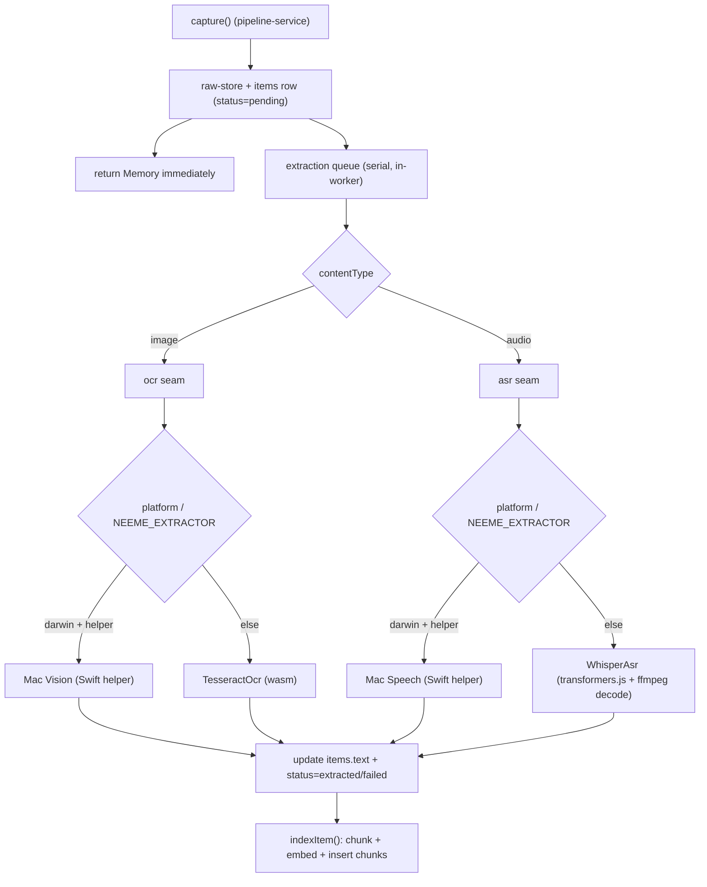

# Image + audio extraction (OCR / ASR) — roadmap #5

Implements [ADR 0005](docs/adr/0005-image-audio-extraction.md). Today, `extract()` parks `image`/`audio` as `pending` forever ([extract.ts:69](apps/desktop/src/main/pipeline/extract.ts)). We add OCR + ASR behind a per-type seam, run them **async after capture** in the worker, and write `text` + flip `status` so the item gets chunked, embedded, and surfaced like text/PDF.

## Architecture

The seams mirror `embedder` ([embed.ts:60-95](apps/desktop/src/main/pipeline/embed.ts)) and `drafter` ([draft.ts:255-262](apps/desktop/src/main/pipeline/draft.ts)): a plain interface, concrete impls with **lazy dynamic import** of heavy deps, and an env/platform-selected singleton.

## 1. Extractor seams (new files)

- `**apps/desktop/src/main/pipeline/ocr.ts`** — `interface Ocr { name; extract(bytes, mime?): Promise<string> }`; `TesseractOcr` (lazy `import('tesseract.js')`, cache traineddata under `userDataDir()/models/tesseract`); `MacVisionOcr` (spawns the Swift helper); `export const ocr` selected by `process.platform === 'darwin'` + helper presence, overridable via `NEEME_EXTRACTOR=portable|native|off`.
- `**apps/desktop/src/main/pipeline/asr.ts`** — `interface Asr` (same shape); `WhisperAsr` (decode container → 16kHz mono f32 PCM via bundled ffmpeg, then lazy `import('@huggingface/transformers')` `automatic-speech-recognition` pipeline with `chunk_length_s`/`stride_length_s` for long audio; model `Xenova/whisper-tiny`, override `NEEME_WHISPER_MODEL`); `MacSpeechAsr` (Swift helper); `export const asr` selected the same way.
- **HEIC prep** (the ADR-flagged risk): in `TesseractOcr`, if HEIC, convert via `heic-convert` (pure-JS, no native rebuild — avoid `sharp`) to JPEG before OCR.

## 2. Wire the dispatcher

In **[extract.ts](apps/desktop/src/main/pipeline/extract.ts)** keep `extract()` synchronous for text/pdf. Add `extractMedia(contentType, bytes, mime?)` that routes `image → ocr`, `audio → asr`, returns `{ text, status }`. Leave the `image`/`audio` arm of `extract()` returning `pending` (capture still resolves instantly).

## 3. Async lifecycle (pipeline-service)

In **[pipeline-service.ts](apps/desktop/src/main/services/pipeline-service.ts)**:

- After `capture()` inserts a `pending` image/audio row (current behavior at :40-46), enqueue a background extraction job instead of blocking. `capture()` still returns the `Memory` immediately.
- Add a small **serial queue** (promise chain) so two heavy models never load at once. Job: `extractMedia()` → `UPDATE items SET text, status` (`extracted`/`failed`) → `indexItem(id, text)` (reuses :49-59).
- **Resume pass on boot:** in [worker/index.ts](apps/desktop/src/main/worker/index.ts) `start()` (next to `syncEmbedder()` at :56-60), scan `items WHERE status='pending' AND content_type IN ('image','audio')` and enqueue them — retroactively extracts already-captured media and recovers from crashes. Best-effort (failure must not block boot).

## 4. macOS native fast path

- `**apps/desktop/resources/mac/nimi-extract.swift`** → compiled CLI with `ocr <path>` (Vision `VNRecognizeTextRequest`) and `asr <path>` (Speech on-device `SFSpeechRecognizer`/`SpeechTranscriber`), text to stdout, nonzero exit on failure.
- **Build:** compile via `swiftc` in an electron-builder `mac` hook (or check in a prebuilt binary) into `resources/mac/`; `asarUnpack: resources/`** already unpacks it ([electron-builder.yml:12-13](apps/desktop/electron-builder.yml)).
- **Path injection:** in [worker/client.ts:23-26](apps/desktop/src/main/worker/client.ts) pass `NEEME_MAC_HELPER` (resolve under `process.resourcesPath` packaged; a dev build path otherwise) alongside `NEEME_USER_DATA` — keeps the worker electron-free.
- **Entitlements/permissions:** add `NSSpeechRecognitionUsageDescription` to `mac.extendInfo` and the speech entitlement to `build/entitlements.mac.plist`. Vision OCR needs no permission (low risk → enable now); native Speech is best-effort, with portable Whisper as the guaranteed fallback if authorization/locale fails.

## 5. ffmpeg packaging (portable audio decode)

Add `ffmpeg-static`; resolve its binary path in `asr.ts` with the asar→`app.asar.unpacked` rewrite, and add `node_modules/ffmpeg-static/`** to `asarUnpack`. Spawn `ffmpeg -i <in> -ac 1 -ar 16000 -f f32le -` and read stdout into a `Float32Array`.

## 6. Contract / status

No schema migration — `text`/`status` columns and the `pending|extracted|failed` values already exist ([schema.ts:32-43](apps/desktop/src/main/db/schema.ts), [ipc.ts:47](packages/contract/src/ipc.ts)). The feed maps `extracted → done` already ([project.ts:86-95](apps/desktop/src/main/services/project.ts)). UI reflects pending→done on the next `feed()`/`archive()` fetch.

- *Optional (nice-to-have, not required):* an `'extracting'` status + a `pipeline:items-changed` main→renderer push event (mirrors `authChanged`) for live feed refresh. Flag as a follow-up to keep this PR scoped.

## 7. Deps + env

- Add: `tesseract.js`, `heic-convert`, `ffmpeg-static` to `apps/desktop/package.json`. Whisper reuses the existing `@huggingface/transformers`.
- New env (all under the `NEEME_`* glob already in [turbo.json:10](turbo.json)): `NEEME_EXTRACTOR` (`portable`/`native`/`off`), `NEEME_WHISPER_MODEL`, `NEEME_OCR_LANG` (default `eng`). `off` preserves today's park-as-pending for CI/headless.

## 8. Docs

Flip [ADR 0005](docs/adr/0005-image-audio-extraction.md) to Accepted + check action items 1–4 (note native Speech caveat); update ROADMAP #5; add an INTEGRATION.md line that image/audio extract asynchronously post-capture.

## Verify

`pnpm typecheck` + `pnpm build`. Worker smoke (data-layer recipe in AGENTS.md) with `NEEME_USER_DATA` + `NEEME_EMBEDDER=hash`: `captureFile` a PNG and an m4a, confirm `status` flips to `extracted` and `search()` returns the OCR'd / transcribed text. On macOS, confirm the Vision/Speech helper path is used (and that forcing `NEEME_EXTRACTOR=portable` falls back cleanly).

## Risks / notes

- **Audio decode** is the main complexity: Whisper needs raw 16kHz PCM; ffmpeg is the pragmatic decoder (binary packaging caveat above).
- **Native Speech ASR** TCC authorization from a bundled helper is the riskiest piece — keep portable Whisper as the always-available fallback.
- First-use model/traineddata downloads add latency (same playbook as the embedder); the serial queue bounds memory.

