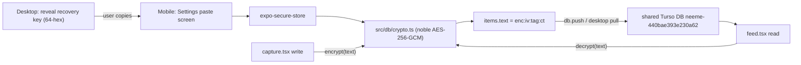

# Mobile E2E Crypto Parity (unblocks V7)

## The actual blocker (from V7 finding)

Desktop content-encrypts `items.text` at the **application layer**: `node:crypto` AES-256-GCM, stored as `enc:<iv_hex>:<tag_hex>:<ct_hex>` (see [apps/desktop/src/main/db/crypto.ts](apps/desktop/src/main/db/crypto.ts)). Mobile writes/reads **plaintext**. Parity = mobile applies the **byte-identical** codec to `items.text`.

Critical distinction: the `remoteEncryption` param in [apps/mobile/src/db/client.ts](apps/mobile/src/db/client.ts) is Turso's *transport/at-rest* layer — a different thing. Desktop does **not** use it, so mobile must keep it `undefined`, otherwise the two replicas can't read each other. The fix is purely field-level.

## Approach (confirmed)

- AES-256-GCM via `@noble/ciphers` (pure-JS, no native rebuild); random 12-byte IV via `expo-crypto`.
- Shared key via a **recovery-key paste** screen, stored in `expo-secure-store` — mirrors desktop's `setRecoveryKey`/`getExistingKey` in [apps/desktop/src/main/sync/sync-prefs.ts](apps/desktop/src/main/sync/sync-prefs.ts). No broker change; server never sees the key.

## Data flow

## Changes

### 1. Dependencies — [apps/mobile/package.json](apps/mobile/package.json)

Add `@noble/ciphers` and `expo-crypto` (`expo install expo-crypto` for SDK-pinned version). `@noble/ciphers` is already a transitive dep candidate; pin explicitly.

### 2. New codec — `apps/mobile/src/db/crypto.ts`

Mirror the desktop API and **exact wire format** so values interop byte-for-byte:

- `encrypt(plaintext: string, keyHex: string): string` → `enc:<iv>:<tag>:<ct>`. Use `gcm(key, iv)` from `@noble/ciphers/aes`; noble returns `ct || tag` (last 16 bytes are the tag) — split them to match desktop's separate `:<tag>:` field. IV from `expo-crypto.getRandomBytes(12)`.
- `decrypt(value: string, keyHex: string): string` → pass through non-`enc:` values (legacy/plaintext rows), recombine `ct||tag` for `gcm().decrypt()`, return raw + warn on failure (same resilience as desktop lines 79-111).
- `hasValidKey(keyHex)` using the same `/^[0-9a-f]{64}$/i` regex.
- Key is an **explicit argument** (RN has no runtime `process.env` for secrets like desktop's `NEEME_SYNC_ENCRYPTION_KEY`).

### 3. Key storage — `apps/mobile/src/db/key-store.ts`

`getSyncKey()` / `setSyncKey(hex)` / `clearSyncKey()` over `expo-secure-store` (same lib as [apps/mobile/src/utils/auth.ts](apps/mobile/src/utils/auth.ts)), validating 64-hex and normalizing to lowercase — mirrors `setRecoveryKey` in sync-prefs.ts.

### 4. Wire the key into the DB layer — [apps/mobile/src/db/client.ts](apps/mobile/src/db/client.ts) + [apps/mobile/src/db/bootstrap.ts](apps/mobile/src/db/bootstrap.ts)

- Load the key from key-store at bootstrap and hold it in module state; expose `getSyncKey()` for screens.
- Keep `remoteEncryption: undefined` and add a comment: field-level enc, not Turso transport enc (parity with desktop).

### 5. Encrypt/decrypt at the edges

- [apps/mobile/app/(tabs)/capture.tsx](apps/mobile/app/(tabs)/capture.tsx) line ~32: `text` value → `encrypt(trimmed, key)` before INSERT.
- [apps/mobile/app/(tabs)/feed.tsx](apps/mobile/app/(tabs)/feed.tsx) `parseRow`: `decrypt(row.text, key)`.
- When no key is set: write plaintext + show a non-blocking banner ("Add your recovery key in Settings to sync securely with desktop"). Desktop already passes non-`enc:` values through, so this degrades safely.

### 6. Recovery-key UI — `apps/mobile/app/(tabs)/settings.tsx` (new tab)

Paste field + "Save key", a masked status ("Key set ✓ / not set"), and a clear button. Register in [apps/mobile/app/(tabs)/_layout.tsx](apps/mobile/app/(tabs)/_layout.tsx). After save, trigger a feed refresh so existing `enc:` rows decrypt.

## Verification

1. `pnpm --filter @nimi/mobile typecheck` stays green.
2. **Interop parity script** — `apps/mobile/scripts/crypto-parity.ts` (run with `tsx`): with a fixed 64-hex key, (a) decrypt a desktop-`crypto.ts`-produced `enc:` string using the mobile codec, and (b) encrypt with mobile and decrypt with desktop `crypto.ts`. Both must round-trip. This proves byte parity in Node **before** any device build.
3. **V7 live E2E**: reveal key on desktop → paste in mobile Settings → enable desktop Cloud sync → capture a note on each device → confirm the other shows readable plaintext (not `enc:…`), per the runbook style in `docs/agent-sync/HANDOFF-mobile-rn-turso.md`.

## Out of scope (note as follow-ups)

- Todos parity (mobile has no todos UI yet; desktop encrypts `title`/`notes`).
- Broker-returned key (rejected: weaker posture).
- Updating the handoff doc's V7 row to PASS after the live run.

