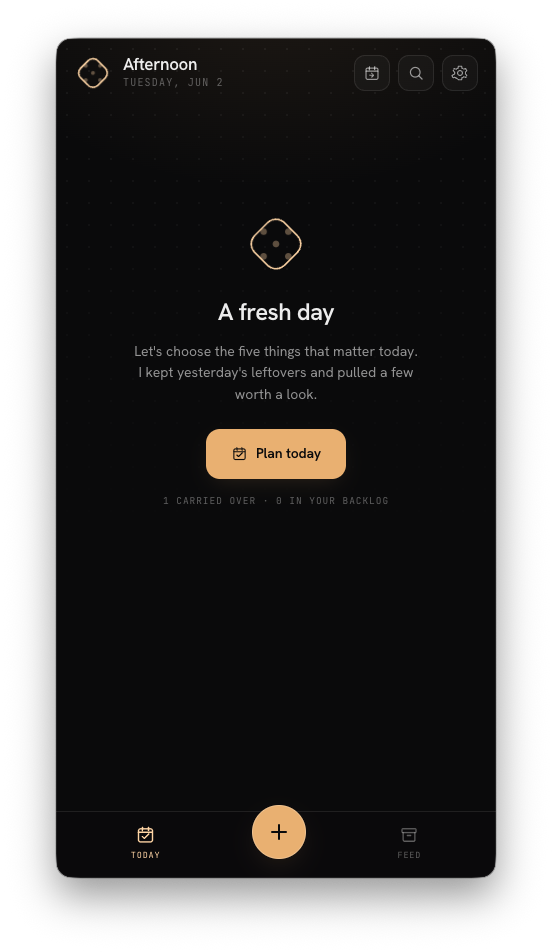

# UX / workflow punch list (front lane)

Front-lane (`apps/desktop/src/renderer`) UX bugs and workflow decisions to debug.
Captured from a live walkthrough — see screenshot below. Newest batch on top;
check items off (`- [x]`) as they land, and keep the code pointers current.

> Lane note: these are all renderer-side. Where a fix needs a contract change
> (e.g. an explicit "add to backlog" mutator), call it out and land the
> `@nimi/contract` half first.

---

## Batch — 2026-06-02 (Today empty-state walkthrough)

### 1. Search button placement is inconsistent
- **Symptom:** search doesn't sit in a predictable top-right slot across screens.
- **Today:** it's the *middle* of three header buttons — plan-tomorrow, search,
  settings (`today.tsx` `AppHeader`, ~L57–65).
- **Task detail:** present in header (`task.tsx` ~L367).
- **Feed:** the Feed header has **no** search button at all.
- **Want:** search consistently pinned top-right (same slot, same order) on every
  primary screen, or a single shared header component that owns the button order.
- **Opportunity:** factor the header button cluster into one component so order
  can't drift per screen.

### 2. The "A fresh day / Plan today" page was supposed to be gone
- **Symptom:** this empty-state hero ("A fresh day", "Plan today", "N carried
  over · N in your backlog") still shows — thought it was removed.
- **Pointer:** Today empty state in `today.tsx`; but `NimiApp.tsx` ~L255 has
  `setOverlay('plan') // go straight to planning — no empty intermediate screen`,
  so the *intent* was to skip an empty intermediate screen. Intent vs. reality
  disagree.
- **Want:** decide whether this hero stays (and is the canonical fresh-day entry)
  or is removed in favor of going straight to the Plan ritual. Then make the code
  match the decision.

### 3. Define what the **+** (FAB) button does
- **Current:** the FAB always opens `AddSheet` defaulting to `mode='feed'`
  ("Feed a memory" tab) — `NimiApp.tsx` `onAdd` → `setOverlay('add')`;
  `add.tsx` `useState<'feed'|'todo'>('feed')` (~L35).
- **Want:** write down the intended behavior/spec so the default tab and entry
  points are deliberate (see #5 for the context-aware default).

### 4. Where does a new to-do get added? (today vs. backlog toggle)
- **Current:** `TodoPane` hard-codes the destination — the hint literally reads
  `GOES TO BACKLOG` (`add.tsx` ~L565). `NimiApp.addTodo` (~L198) only falls back
  to backlog when the cap-5 is already reached (`CAP_REACHED`); otherwise it tries
  Today. There is no user-facing choice.
- **Want:** an explicit **"Add to Today"** toggle in the add-to-do flow:
  - enabled only when Today has room (under the cap-5),
  - otherwise the to-do goes to the backlog (and the toggle is shown disabled with
    a reason, e.g. "Today's full").
- **Contract note:** there is currently no "add to backlog" mutator
  (`NimiApp.tsx` ~L198–213 fakes it in local state). A clean fix likely needs a
  contract addition — land that first.

### 5. On the backlog screen, **+** should default to "Add a to-do"
- **Current:** the FAB always opens the Add sheet on the **Feed** tab regardless of
  where you launched it from. Nav today is only `today` / `feed` — **there is no
  backlog screen yet**, so this depends on #2/#4 work that introduces one.
- **Want:** when the user is on the backlog surface, pressing **+** opens
  `AddSheet` with `mode='todo'` (the "Add a to-do" tab) instead of "Feed a memory".
- **Implementation hint:** give `AddSheet` an `initialMode` prop and have the FAB
  pass it based on the active screen.

---

## Cross-cutting

- **Header consolidation (#1, #3):** a shared header/FAB component would make
  button order and the FAB's context-aware default (#5) live in one place.
- **Contract gap (#4):** an explicit backlog mutator unblocks the today/backlog
  toggle and a real backlog screen (#5).
