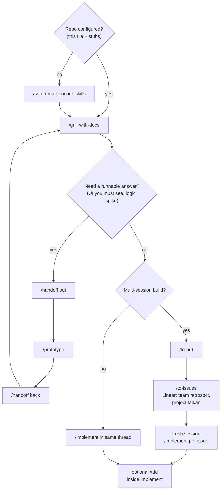

# Agent reference (Mikan)

**One doc for humans and agents.** Canonical Matt Pocock idea → ship flow, Linear setup,
triage labels, domain docs, and related Mikan pointers.

Matt Pocock skills still look for `issue-tracker.md` / `triage-labels.md` / `domain.md` —
those files are thin pointers back here. Prefer this file.

Router when stuck: `/ask-matt`.

---

## Contents

1. [Recommended Matt flow](#1-recommended-matt-flow)
2. [Matt skills — use / skip](#2-matt-skills--use--skip)
3. [Linear issue tracker](#3-linear-issue-tracker)
4. [Triage labels](#4-triage-labels)
5. [Domain docs](#5-domain-docs)
6. [Optional on-ramps (not the main flow)](#6-optional-on-ramps-not-the-main-flow)
7. [Privacy diagrams (Ask Mikan)](#7-privacy-diagrams-ask-mikan)
8. [Checklist + anti-patterns](#8-checklist--anti-patterns)

---

## 1. Recommended Matt flow

This is the **typical / recommended** path. Follow it unless you have a clear reason not to.

```text
1. /setup-matt-pocock-skills     ← once per repo (or when tracker/labels/domain docs drift)
2. /grill-with-docs              ← sharpen + write CONTEXT.md + ADRs
3. (optional) /handoff → /prototype → /handoff back
                                 ← only if conversation cannot settle a question
4a. Small?  → /implement         ← same thread
4b. Big?    → /to-prd → /to-issues → fresh /implement per issue
              (inside /implement, optionally /tdd)
```



### When to start where

| Situation | Start with |
|---|---|
| New feature / design with a codebase | `/grill-with-docs` (after setup if needed) |
| Don't know which skill | `/ask-matt` |
| Already have PRD + `ready-for-agent` issue | `/implement` only (optionally `/tdd`) |
| Inbound bugs / requests you didn't author | `/triage` → `/implement` (on-ramp, not main flow) |
| No codebase at all | `/grill-me` (stateless; no ADRs/`CONTEXT.md`) |

**Rule of thumb:** Matt skills are for *shipping with durable memory* (`CONTEXT.md` + ADRs + Linear). One-off Q&A does not need the flow.

### What each main-flow step does

| Step | Job |
|---|---|
| **Setup** | Point skills at Linear, triage labels, domain layout |
| **Grill-with-docs** | One-question interview; persist decisions in `CONTEXT.md` + ADRs |
| **Prototype** | Answer a question conversation can't (UI you must see, stateful spike) |
| **to-prd** | Durable spec for multi-session work |
| **to-issues** | Split PRD into independently grabbable Linear tickets (`ready-for-agent`) |
| **implement** | Build one issue in a clean context window |
| **tdd** | *How* you implement — red→green→refactor; **not** a separate phase between grill and PRD |

### Context hygiene

1. Keep **grill → PRD → issues** in **one unbroken window** when possible.
2. **Fresh session per `/implement` issue** — don't carry the whole grill into every ticket.
3. Approaching ~120k tokens before `/to-issues`? **`/handoff`** — don't grind degraded.
4. **`/handoff`** = fork to a new chat with a file. **`/compact`** = stay and summarize. Prefer handoff at phase boundaries.

---

## 2. Matt skills — use / skip

| Skill | Use when | Skip when |
|---|---|---|
| `/ask-matt` | Don't know which skill fits | Already know the next step |
| `/setup-matt-pocock-skills` | First time / this doc drifted | Already accurate — only refresh |
| `/grill-with-docs` | Have a **codebase**; need durable decisions | No repo → `/grill-me` |
| `/grill-me` | Sharpen a plan with **no codebase** | In-repo work (won't write `CONTEXT.md` / ADRs) |
| `/to-prd` | Multi-session / multi-issue build | Tiny one-session change |
| `/to-issues` | PRD ready; independently grabbable work | One-shot implement in-thread |
| `/implement` | Agent-ready issue in hand | Open product questions remain → grill |
| `/tdd` | During `/implement` (or bugfix); behavior-first tests | Pure docs/rename; or when you're not writing code yet |
| `/triage` | Issues **you didn't create** (inbound) | Issues from `/to-issues` (already ready) |
| `/prototype` | Need throwaway runnable proof | Conversation can settle it |
| `/handoff` | Cross sessions / phase boundary | Mid-phase stay-put → `/compact` |
| `/improve-codebase-architecture` | Spare time; agent-friendly upkeep | Active feature ship |
| `/teach`, `/writing-great-skills` | Learning / authoring skills | Feature delivery |

### Related non-Matt skills (optional on-ramps)

These are **not** required steps. Use them only when they help; then rejoin the Matt flow at grill or implement.

| Skill | Role vs Matt |
|---|---|
| `/ce-brainstorm` | **WHAT** to build before grill. Does **not** replace ADRs/`CONTEXT.md`. |
| `/ce-plan` | **HOW** after requirements. Overlaps `/to-prd` — pick one planning style per feature. |
| brainstorming / grilling | Prefer `/grill-with-docs` in-repo so domain-modeling persists. |
| domain-modeling | Writes `CONTEXT.md` + ADRs; invoked by grill-with-docs. |
| mermaid-diagrams | Document flows **after** decisions — not a substitute for grilling. |

---

## 3. Linear issue tracker

Issues and PRDs live in **Linear**, not GitHub Issues. Skills `to-issues`, `triage`, `to-prd`, `qa` operate against Linear.

### Where to look (canonical)

| | Value |
|---|---|
| **Workspace** | [retrospct](https://linear.app/retrospct) |
| **Team** | **retrospct** (issue key prefix `RETRO-…`) |
| **Project** | **Mikan** — [open in Linear](https://linear.app/retrospct/project/mikan-722e3699ff26) |
| **MCP** | Cursor `plugin-linear-linear` |

When creating or listing issues for this repo: set **team = `retrospct`** and **project = `Mikan`**. Do not invent a separate "Mikan" team — Mikan is the *project* under the retrospct team. Other workspace teams (e.g. NihonGo) are unrelated.

**PRs as a request surface: no.** External GitHub PRs are not triage input. `/triage` operates only on Linear issues.

### One-time Linear setup (human, in the Linear UI)

Two different "triage" concepts:

| Concept | What it is | Where |
|---|---|---|
| **Linear Triage inbox** | Holding queue *before* Backlog/Todo | Team Settings → Triage (**retrospct** team) |
| **Matt triage labels** | Labels skills read/write | [§4](#4-triage-labels) |

#### Enable the Triage inbox (recommended for inbound / external work)

**Yes — turn Triage on** if Slack / email / Asks / integrations / non-team members should land in a review queue instead of the backlog.

1. **Team Settings → Triage** for the **retrospct** team → toggle **on** (shortcut `G` then `T`).
2. Optional: **Triage responsibility**, **require priority** before accept.
3. Wire intake (Slack, Sentry, Linear Asks, …) to the **retrospct** team / **Mikan** project — with Triage on, those create in Triage status.

Docs: [Linear — Triage](https://linear.app/docs/triage).

| Path | Use Triage inbox? |
|---|---|
| External bugs / Slack / Asks / Sentry | **Yes** |
| `/to-issues` from a PRD (team-member create) | **No** — already `ready-for-agent` |

If Triage is **off**, externals go to default status (usually Backlog). `/triage` still works via **labels**, but you lose the dedicated inbox.

#### Create labels + Cursor MCP

1. Create the labels in [§4](#4-triage-labels) (and optionally `bug` / `enhancement`).
2. Enable Linear MCP in Cursor (`plugin-linear-linear`); complete OAuth on first tool call.
3. Confirm `list_teams` sees **retrospct** and `list_projects` (query `Mikan`) sees the project.

No separate "MCP triage" switch — routing follows team Triage settings.

```text
External → Linear Triage inbox (team retrospct) → /triage + labels → ready-for-agent → /implement

/grill-with-docs → /to-prd → /to-issues → Linear team retrospct + project Mikan (skip Triage) → /implement (± /tdd)
```

### How agents operate Linear

MCP: Cursor `plugin-linear-linear` (Claude Code: `productivity:linear`). Auth errors → ask the user to authorize; don't silently retry. Headless without auth → report unreachable (don't fall back to another tracker).

| Op | Tool |
|---|---|
| Create / update | `save_issue` with `team: "retrospct"` and project **Mikan** (`list_teams` / `list_projects` to resolve IDs if needed) |
| Read | `get_issue`, `list_comments` |
| List / search | `list_issues` filtered to team **retrospct** / project **Mikan** when scoping this repo |
| Comment | `save_comment` |
| Labels | `list_issue_labels` / `create_issue_label` → `save_issue` |
| State / close | `list_issue_statuses` / `get_issue_status` → `save_issue` (Done/Canceled, don't delete) |

Identifiers are Linear keys like `RETRO-123`, not bare integers.

- **Publish to the issue tracker** → create a Linear issue on team **retrospct**, project **Mikan**.
- **Fetch the relevant ticket** → `get_issue` + comments.

---

## 4. Triage labels

Skills speak in five canonical roles. We use the names **verbatim** as Linear labels.

> Not the same as Linear's Triage inbox ([§3](#3-linear-issue-tracker)).

| Canonical role | Label in Linear | Meaning |
|---|---|---|
| `needs-triage` | `needs-triage` | Maintainer needs to evaluate |
| `needs-info` | `needs-info` | Waiting on reporter |
| `ready-for-agent` | `ready-for-agent` | Fully specified; AFK agent can pick up |
| `ready-for-human` | `ready-for-human` | Requires human implementation |
| `wontfix` | `wontfix` | Will not be actioned |

When a skill says "apply the AFK-ready triage label", apply `ready-for-agent`. Edit the right-hand column only if you remap to different Linear strings.

---

## 5. Domain docs

This repo is **single-context**.

### Before exploring, read

- **`CONTEXT.md`** (root) — domain glossary / ubiquitous language.
- **`docs/adr/`** — ADRs for the area you're touching. Current set: sync/processing (0001), auth (0002), on-device pipeline (0003), AI drafting (0004), image/audio extraction (0005), monorepo (0006), connectors (0007), sync auth-token broker (0008), mobile RN + Turso + cloud-AI (0009), shadcn/Base-UI + Phosphor foundation (0010), desktop Ask Mikan architecture (0011).

If those files are missing, **proceed silently**. Root `CLAUDE.md`, `apps/desktop/CLAUDE.md`, `docs/INTEGRATION.md`, and `docs/SECURITY.md` also carry vocabulary.

### Layout

```
/
├── CONTEXT.md
├── docs/adr/          ← … through 0011-desktop-ask-mikan-architecture.md
├── apps/desktop/
└── packages/contract/
```

### Vocabulary + ADR conflicts

Use `CONTEXT.md` terms in issue titles, refactors, hypotheses, tests. New terms → signal for `/domain-modeling`.

If output contradicts an ADR, surface it:

> _Contradicts ADR-0003 (all-TypeScript on-device pipeline) — but worth reopening because…_

---

## 6. Optional on-ramps (not the main flow)

Use these **before** rejoining grill, or **never** if the idea is already sharp enough to grill.

| Extra | When it helps | Then rejoin at |
|---|---|---|
| Library / stack research | You need options before deciding | `/grill-with-docs` |
| `/ce-brainstorm` | Vague product shape; need a requirements pass | `/grill-with-docs` (persist ADRs/`CONTEXT.md`) |
| Story / Mermaid diagrams | Explaining a decided privacy or architecture story | After ADRs exist — not instead of grill |
| Renames / mechanical refactors | Naming already decided | Plan + verify — skip Matt flow |

**Do not** treat research → brainstorm → diagrams → rebrand as the recommended Matt sequence. That is an optional front door. The Matt core remains:

**setup → grill → (prototype?) → PRD → issues → implement (± tdd)**

Existing Ask Mikan artifacts (after grilling): [ADR-0010](../adr/0010-agent-ui-foundation.md), [ADR-0011](../adr/0011-desktop-ask-mikan-architecture.md), [agent-ui-foundation.prd.md](../plans/agent-ui-foundation.prd.md), [ask-mikan-desktop.prd.md](../plans/ask-mikan-desktop.prd.md). Next Matt ship step for those: `/to-issues` → `/implement`.

---

## 7. Privacy diagrams (Ask Mikan)

Narrative: [`docs/privacy/ask-mikan-privacy-story.md`](../privacy/ask-mikan-privacy-story.md).  
Assets: [`docs/privacy/diagrams/`](../privacy/diagrams/).

| Diagram | File | Remembers |
|---|---|---|
| RAG / escalation | `01-rag-escalation-flow` | Local search → opt-in Ask Mikan → top-K only |
| Device / cloud boundary | `02-device-cloud-boundary` | What leaves vs stays |
| Consent state | `03-consent-state` | Off by default; degrade offline |
| Desktop vs mobile | `04-desktop-vs-mobile` | Client-grounded retrieval sidesteps server crypto-search |

ADRs: [0010](../adr/0010-agent-ui-foundation.md), [0011](../adr/0011-desktop-ask-mikan-architecture.md). Vocab: [`CONTEXT.md`](../../CONTEXT.md).

```bash
# re-export after editing .mmd (mmdc is a root devDependency)
pnpm exec mmdc -i docs/privacy/diagrams/01-rag-escalation-flow.mmd \
  -o docs/privacy/diagrams/01-rag-escalation-flow.svg
```

---

## 8. Checklist + anti-patterns

1. [ ] Setup current? (`REFERENCE.md` + Linear team/project + labels.)
2. [ ] `/grill-with-docs` — one question at a time; write `CONTEXT.md` + ADRs as decisions crystallize.
3. [ ] Need to *see* it? `/handoff` → `/prototype` → `/handoff` back.
4. [ ] Multi-session? `/to-prd` → `/to-issues` (team **retrospct**, project **Mikan**) → fresh `/implement` per issue.
5. [ ] Building behavior? Optionally `/tdd` **inside** `/implement` (vertical slices, not “all tests then all code”).
6. [ ] Story diagrams **after** ADRs, not instead of them.
7. [ ] Verify: `pnpm typecheck` / `build` / smoke — Electron worker needs a GUI agent.

| Anti-pattern | Do this instead |
|---|---|
| Brainstorm forever, never persist | Grill → ADR/`CONTEXT.md` same phase |
| Implement mid-grill | Finish design tree first |
| Call `/tdd` as a phase between grill and PRD | `/tdd` only during `/implement` |
| Diagram privacy before consent/retrieval decisions | Decide first, draw second |
| Triage `/to-issues` tickets | They're ready — implement |
| Re-run full setup every time | Refresh only drift |
| Force Matt flow for a rename | Plan + verify once naming is decided |
| Mix CE PRD and Matt PRD for one feature | One durable spec; link ADRs |
| Document “what we did that once” as the standard | Document the recommended flow above |
