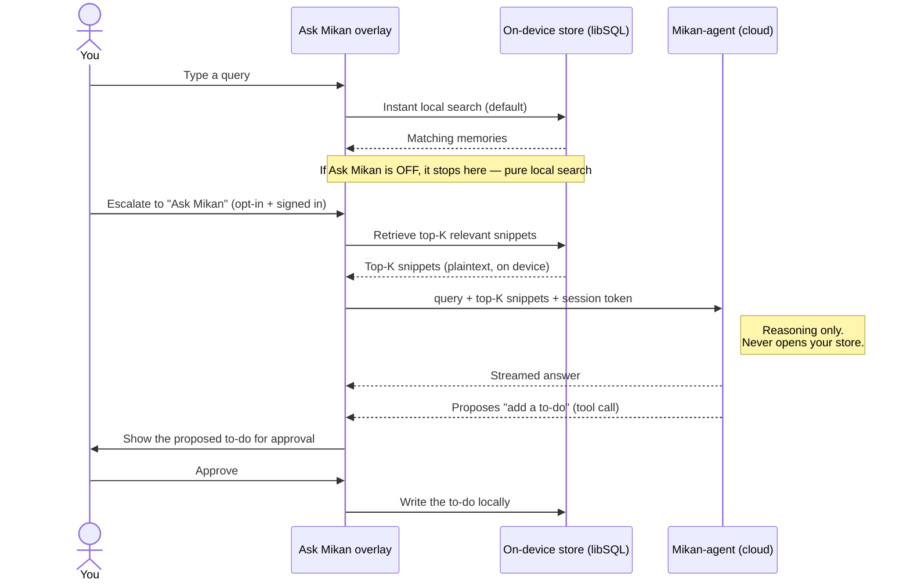
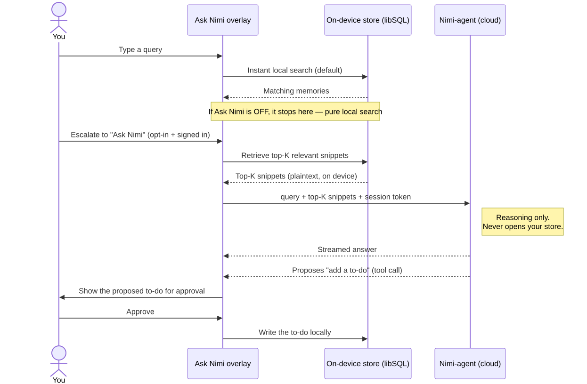
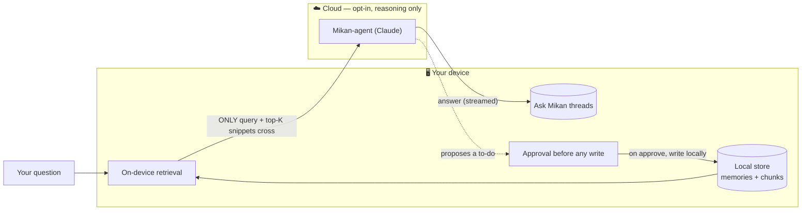
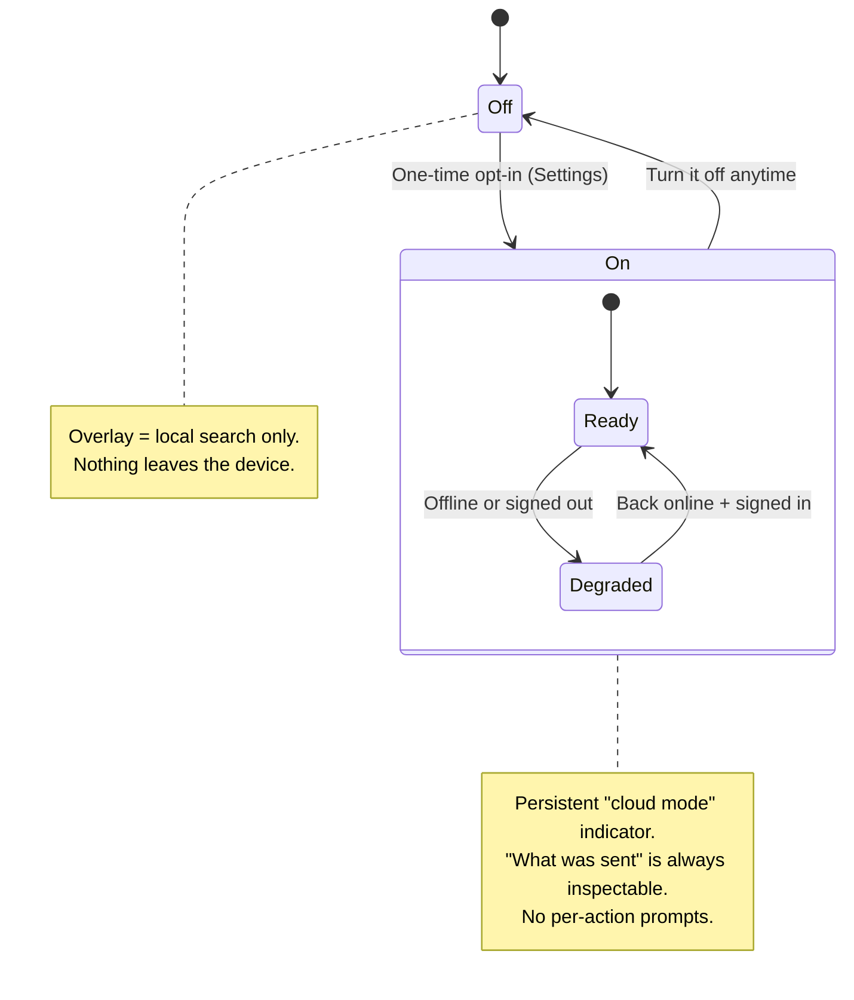
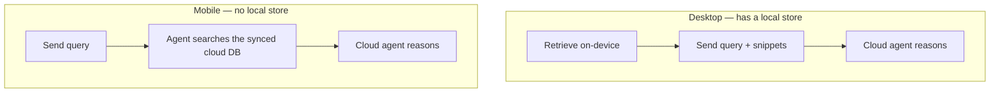

# How Ask Mikan keeps your data on your device

> A narrative explainer of Mikan's privacy model for the conversational agent — written to be
> readable on its own and to seed a blog post. The *decisions* live in
> [ADR-0011](../adr/0011-desktop-ask-mikan-architecture.md) (and 0003 / 0008 / 0009); the *build
> spec* is in [`../plans/ask-mikan-desktop.prd.md`](../plans/ask-mikan-desktop.prd.md); the shared
> vocabulary is in [`CONTEXT.md`](../../CONTEXT.md). This doc tells the *story*.

## The promise

Mikan is **local-first**: your memories live on your device, and the app works fully offline. When
we added a conversational agent ("Ask Mikan") that uses a cloud model to reason, we refused to
quietly turn that promise inside out. The whole design follows four rules:

1. **Off by default.** The agent does nothing until you opt in, once, in Settings.
2. **The device decides what leaves.** Retrieval happens on your machine; only the bits relevant to
   your question are sent — never your whole store.
3. **The cloud reasons; it never reads your store.** The agent gets a question and a few snippets,
   not a key to your data.
4. **No secret keys ship in the app.** Provider keys live only on the server; an optional
   bring-your-own key lives in your OS keychain.

## The default: pure local search

Open the search overlay and start typing, and you get the same thing Mikan has always done —
**instant, on-device search**. Your query is embedded and cosine-matched against the local store.
Nothing leaves your device. If you never opt into the agent, this is the whole experience.

"Ask Mikan" is an **escalation** layered on top of that search — not a replacement for it.

## What happens when you actually ask Mikan

A cloud model has no memory of your data — it only knows what's in the prompt you send. So to answer
a question about *your* stuff, you have to hand it the relevant pieces. Mikan does that retrieval
**on the device** and sends only the result:

Exported image — also available as <a href="diagrams/01-rag-escalation-flow.png">PNG</a> / <a href="diagrams/01-rag-escalation-flow.svg">SVG</a>

This pattern has a name — **retrieval-augmented generation (RAG)**. The twist in Mikan is *where*
the "retrieve" step runs: **on your device**, so the cloud only ever sees the handful of snippets
your own machine judged relevant.

## The boundary: what leaves, what stays

Exported image — also available as <a href="diagrams/02-device-cloud-boundary.png">PNG</a> / <a href="diagrams/02-device-cloud-boundary.svg">SVG</a>

Concretely, for a store with thousands of chunks and a typical `top-K` of ~6:

| What | Leaves your device? | Notes |
|---|---|---|
| Your full memory store | ❌ Never | Stays in local libSQL. |
| The ~6 retrieved snippets | ✅ Yes | Chosen on-device; shown to you in the "what was sent" disclosure. |
| Your typed query | ✅ Yes | Needed for the model to answer. |
| Conversation history | ✅ Yes | The client supplies prior turns; threads themselves persist locally. |
| A new to-do | ↩️ Written locally | The agent *proposes*; you approve; the write happens on-device. |
| Your encryption / recovery key | ❌ Never | The server cannot read your at-rest store (see below). |

## Consent: off by default, transparent, no nagging

Exported image — also available as <a href="diagrams/03-consent-state.png">PNG</a> / <a href="diagrams/03-consent-state.svg">SVG</a>

You opt in **once**. After that there are no repeated "are you sure?" interruptions — instead, a
persistent indicator tells you cloud mode is on, and a disclosure lets you see exactly what was sent
for any answer. Go offline or sign out and the overlay quietly falls back to local search.

## Why desktop and mobile differ (and why that's deliberate)

The desktop has an on-device store; the mobile app (today) does not. So they ground the agent
differently — same agent, different data path:

Exported image — also available as <a href="diagrams/04-desktop-vs-mobile.png">PNG</a> / <a href="diagrams/04-desktop-vs-mobile.svg">SVG</a>

This split is why the desktop design **sidesteps a hard encryption problem**. If we'd made the
*cloud* search your data (the mobile path), the server would need to read your memories in
plaintext — but your synced store is encrypted **at rest under a recovery key only you hold**, so
the server *can't* read it without either holding your key (defeating the point) or building
searchable-encryption (a research-grade problem). By retrieving on the device — where the data is
already decrypted because it's your machine — the server **never opens your store at all**, and that
whole problem simply never arises.

## Keys never ship in the app

Electron and React Native bundles are trivially unpacked, so any secret baked into the client is
effectively public. Therefore:

- **Hosted model:** the provider/gateway key lives **only** in the backend's secrets. The client
  authenticates with its session token and asks the server to do the call.
- **Bring-your-own key (optional):** *your* key is stored in your **OS secure storage** (Keychain /
  SecureStore) and forwarded to the backend per request over TLS — never bundled, never ours.

## The honest part — what we don't claim

Privacy stories lose trust when they overclaim, so to be precise:

- **The model does see the snippets you send.** That's the deliberate, disclosed trade for getting a
  real answer — it's exactly what the "what was sent" disclosure shows you.
- **If you've turned on sync, an encrypted copy of your store already lives in the cloud.** That's
  the sync feature, separate from the agent. What the agent design guarantees is narrower and
  specific: the *agent* never reads that store, and the *device* decides which plaintext snippets
  leave.
- **Conversations are stored on your device, not end-to-end-encrypted from the model.** The model
  necessarily processes the turn you send it.

The claim we *do* stand behind: **your store stays on your device, the cloud only reasons over what
you can see was sent, and you can turn the whole thing off.**

---

### Sources / keep this in sync

- Decisions: [ADR-0011](../adr/0011-desktop-ask-mikan-architecture.md) (agent),
  [ADR-0003](../adr/0003-all-typescript-on-device-pipeline.md) (on-device pipeline),
  [ADR-0008](../adr/0008-sync-auth-token-broker.md) (per-user sync),
  [ADR-0009](../adr/0009-mobile-rn-turso-cloud-pipeline.md) (mobile path).
- Build spec: [`../plans/ask-mikan-desktop.prd.md`](../plans/ask-mikan-desktop.prd.md).
- Vocabulary: [`CONTEXT.md`](../../CONTEXT.md).
- Diagram assets: [`diagrams/`](diagrams/) — `.mmd` source + exported `.png`/`.svg` (rendered via
  `@mermaid-js/mermaid-cli`; re-export after editing the inline Mermaid above).

> If any decision above changes, update the ADR first, then this story. This file is the
> *explanation*; the ADR is the *source of truth*.
